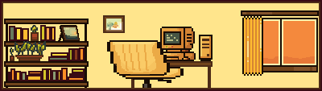

<!-- ===================== -->
<!--        BANNER         -->
<!-- ===================== -->

  

<h1 align="center">Welcome to Amara’s GitHub &lt;/&gt;</h1>

 

<!-- ===================== -->
<!--     NAV BUTTONS       -->
<!-- ===================== -->

  
  
  

 

<!-- ===================== -->
<!--       ABOUT ME        -->
<!-- ===================== -->

<h2 align="center">🌼 About Me</h2>

Computer Science graduate (B.A., New Mexico State University) with interests in backend development,
systems administration, and cybersecurity. I enjoy building clean, maintainable software,
exploring how systems work under the hood, and learning new technologies through hands-on projects.

  
  

 

<!-- ===================== -->
<!--     TECHNOLOGIES      -->
<!-- ===================== -->

<h2 align="center">🧸 Technologies</h2>

  
  
  
  
  

  
  
  
  
  

 

<!-- ===================== -->
<!--   FEATURED PROJECTS   -->
<!-- ===================== -->

<h2 align="center">🍰 Featured Projects</h2>

<table>
  <tr>
    <td width="50%" valign="top">
      <h3>Bias Analysis Web Application</h3>
      

        Full-stack web application analyzing sentiment, toxicity, and bias using NLP models
        and REST APIs. Built collaboratively with a focus on clean architecture and usability.
      

      
<a href="https://github.com/codemelonn">View repository →</a>

    </td>
    <td width="50%" valign="top">
      <h3>Distributed Database Test Application</h3>
      

        Backend-focused project using Apache Cassandra to explore NoSQL data modeling,
        query performance, and distributed system tradeoffs.
      

      
<a href="https://github.com/codemelonn">View repository →</a>

    </td>
  </tr>
  <tr>
    <td width="50%" valign="top">
      <h3>Pearl</h3>
      

        Tetris-style game emulation featuring game state management,
        collision detection, rotation logic, and scoring systems.
      

      
<a href="https://github.com/codemelonn">View repository →</a>

    </td>
    <td width="50%" valign="top">
      <h3>SoundBoxd</h3>
      

        Letterboxd-inspired music rating application. Took a frontend-focused role,
        contributing UI design, layout, and component implementation while coordinating
        development tasks.
      

      
<a href="https://github.com/codemelonn">View repository →</a>

    </td>
  </tr>
</table>

 

<!-- ===================== -->
<!--       STATS           -->
<!-- ===================== -->

<h2 align="center">📊 GitHub Activity</h2>

  
  

  

 

  🤍 thanks for stopping by 🤍

